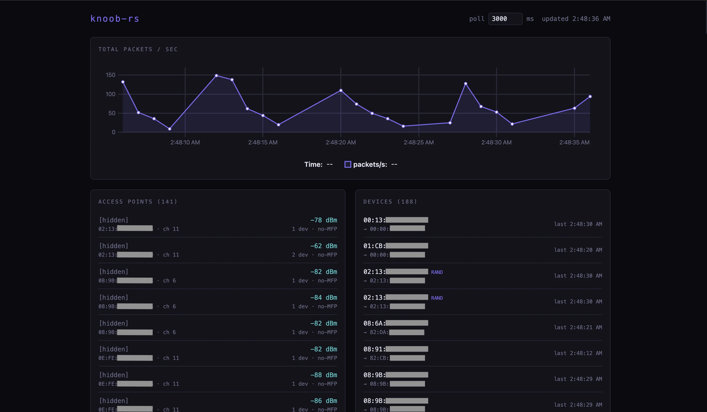
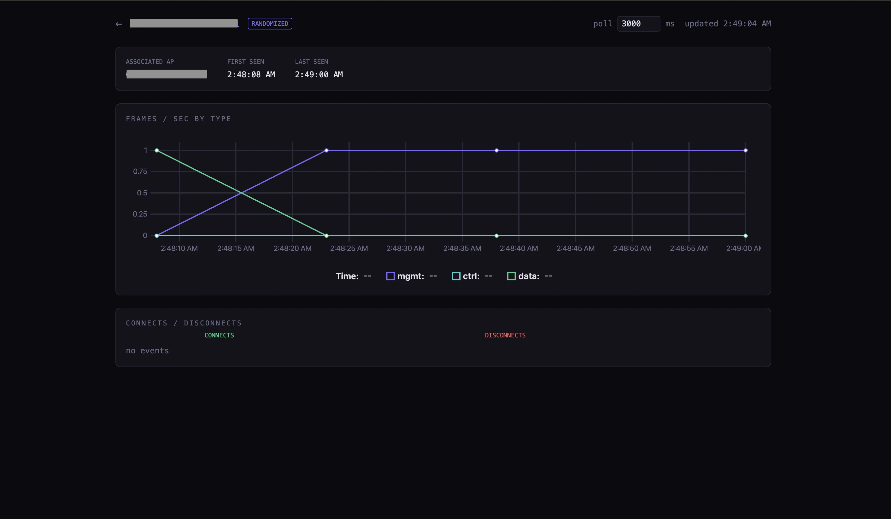

# knoob-rs

A passive 802.11 monitor. Listens for management, control, and data frames on a
monitor-mode wireless interface, tracks access points and client devices, and
serves a web UI showing per-second packet counts and association events.




## What it does

- Captures raw 802.11 frames via `AF_PACKET` on a monitor-mode interface
- Parses radiotap headers for RSSI and channel
- Hops channels across the 2.4 GHz and 5 GHz bands using nl80211
- Tracks access points (BSSID, channel, RSSI, MFP flags)
- Tracks client devices (MAC, last-seen AP, randomized-MAC detection)
- Records per-second frame counts split by type (mgmt / ctrl / data)
- Records assoc, reassoc, disassoc, and deauth events
- Serves a web UI on port 9090 with a live overview and per-device drill-down

## Requirements

- Linux (uses `AF_PACKET` and nl80211)
- A wireless card that supports monitor mode
- Rust 1.85 or newer (uses edition 2024)
- gcc and libc headers
- Node.js 20 or newer to build the frontend
- OUI file from Wireshark (see below)

```
# run in project root at same level as Cargo.toml
curl -o manuf https://www.wireshark.org/download/automated/data/manuf
```

## Build

```
cd web && npm install && npm run build && cd ..
cargo build --release
```

The frontend is statically exported and embedded into the Rust binary at compile
time, so the final artifact at `target/release/knoob-rs` is self-contained.

## Run

The interface must already be in monitor mode:

```
sudo ip link set <iface> down
sudo iw <iface> set monitor control
sudo ip link set <iface> up
```

Then:

```
sudo ./target/release/knoob-rs <iface>
```

Open `http://localhost:9090` in a browser.

## Architecture

```
+----------------------+      +--------------------+      +-----------------+
| capture/ (C)         |      | src/ (Rust)        |      | web/ (Next.js)  |
| - AF_PACKET capture  | ---> | - FFI bindings     | ---> | - uPlot charts  |
| - radiotap + 802.11  |      | - LMDB storage     |      | - 3s poll       |
|   header parsing     |      | - actix-web API    |      | - static export |
| - nl80211 channel    |      | - embedded static  |      |                 |
|   hopper             |      |   frontend         |      |                 |
+----------------------+      +--------------------+      +-----------------+
```

The C layer runs the capture loop and channel hopper on dedicated threads. Each
parsed frame is handed to a Rust callback via a function pointer, which writes
to LMDB. The actix-web server reads from LMDB to answer API requests.

## Storage

Four LMDB environments are created in the working directory on first run:

- `lmdb_aps/`     — access point records, keyed by BSSID
- `lmdb_devices/` — device records, keyed by MAC
- `lmdb_frames/`  — per-second frame counts, keyed by `timestamp_sec ++ MAC`
- `lmdb_events/`  — assoc/disassoc/deauth events, keyed by `timestamp_us ++ MAC`

Environments are opened with `NO_SYNC | NO_META_SYNC` for write throughput. On
power loss, the most recent writes may be lost. The database files themselves
are crash-consistent.

Delete the four directories to wipe history.

## API

| Endpoint                          | Description                                |
|-----------------------------------|--------------------------------------------|
| `GET /api/aps`                    | All access points seen                     |
| `GET /api/devices`                | All client devices seen                    |
| `GET /api/timeseries/total`       | Total packets per second across all devices|
| `GET /api/timeseries/by-device`   | Per-device frame counts split by type      |
| `GET /api/events`                 | All assoc/disassoc/deauth events           |
| `GET /api/events/counts`          | Per-device connect/disconnect totals       |

Time-series endpoints accept optional `from_us` and `to_us` query parameters
(microseconds, monotonic clock).

## Limitations

- nl80211 `CMD_SET_CHANNEL` is the older API. Works on most drivers but has
  been superseded by `CMD_SET_WIPHY` on newer kernels.
- The 6 GHz band is not in the default channel hop list.
- No authentication on the web UI. Bind to localhost or firewall port 9090 if
  exposing the host to an untrusted network.
- LMDB writer is single-threaded (the capture callback is the only writer), so
  capture throughput is bounded by serialization of small RW transactions.
- SSID is not yet extracted from beacon information elements — APs show as
  `[hidden]` until that is added.

## Layout

```
capture/   C capture + channel hop, called from Rust via FFI
src/       Rust: FFI, LMDB, actix-web API, embedded frontend
web/       Next.js frontend, static-exported into web/out
build.rs   compiles C sources, runs bindgen
```
